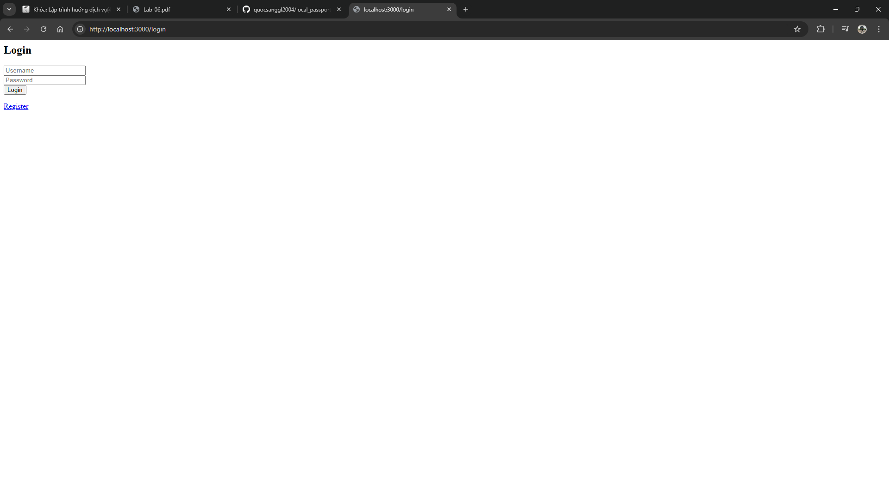
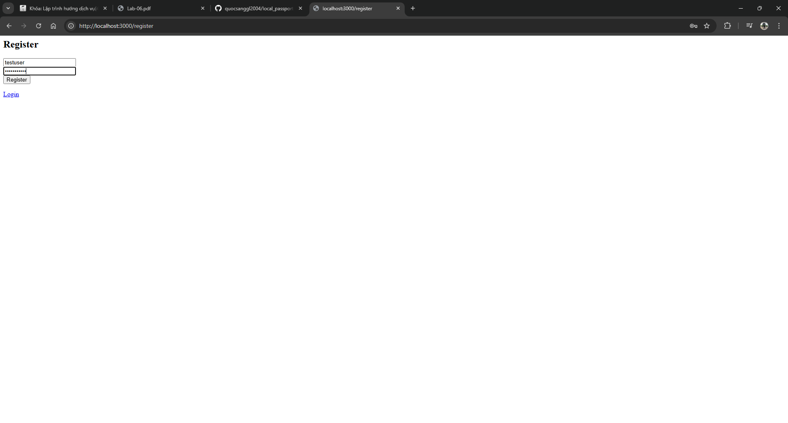
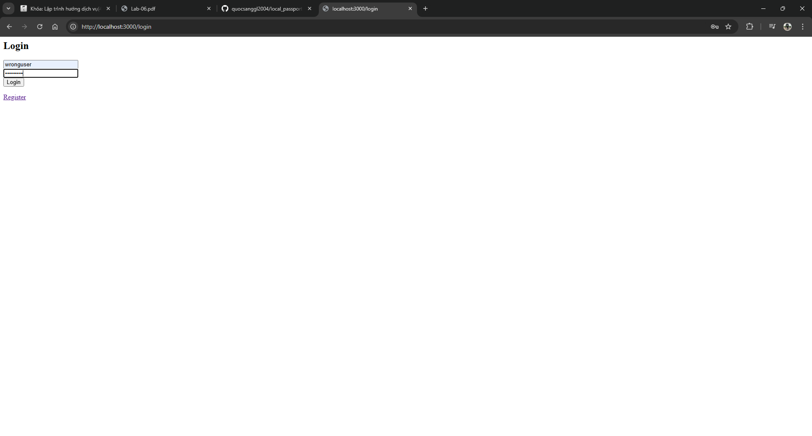
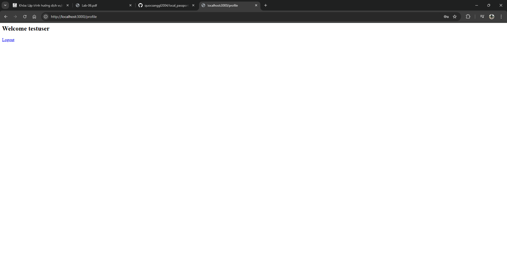
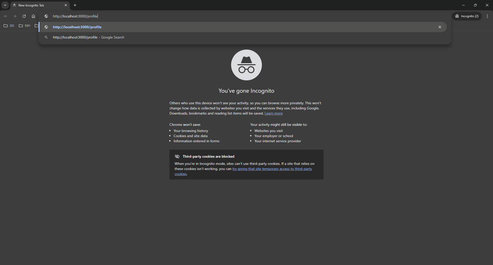
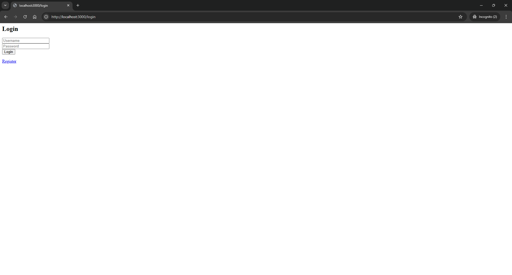
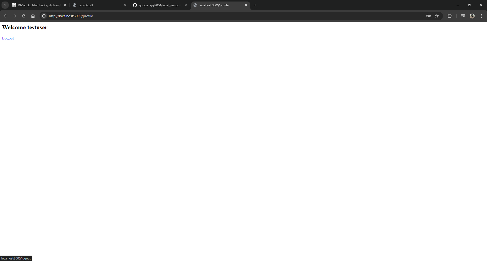
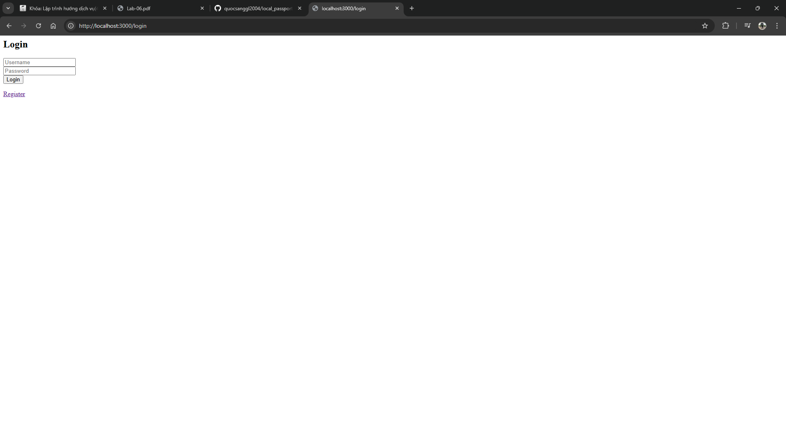
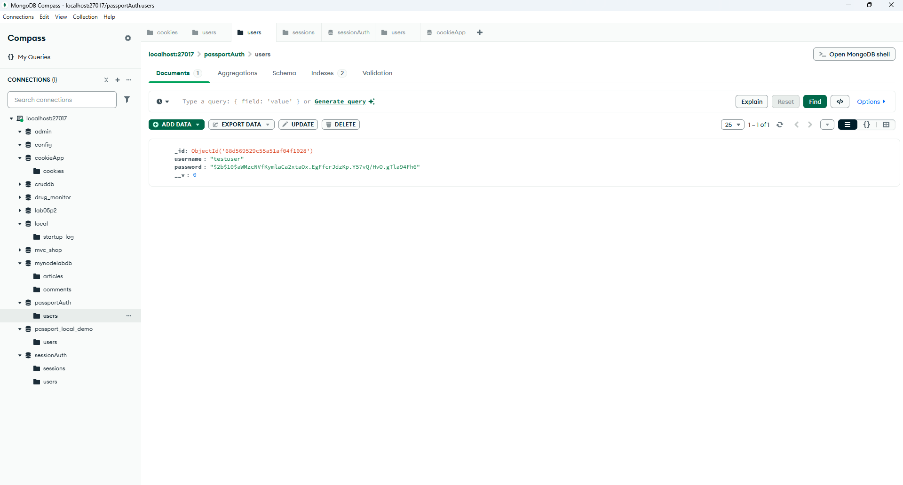

Local Passport Website - RUN BY YOURSELF

Muc dich: Test website authentication voi Passport.js + EJS views

SETUP:
1. Chay MongoDB: net start MongoDB
2. Chay server: node app.js (port 3000)  
3. Mo browser: http://localhost:3000

PROJECT OVERVIEW:
- Full-stack web app voi EJS templates
- Passport.js Local Strategy
- Session-based authentication
- Complete user registration/login flow
- Protected routes with redirects

CACH CHAY TU DONG:

BUOC 1: KHOI DONG SERVER
Chay: node app.js
Ket qua: Server running on http://localhost:3000
Database: passportAuth (MongoDB)

BUOC 2: TRUY CAP WEBSITE
Mo browser: http://localhost:3000
Se tu dong redirect den: http://localhost:3000/login

BUOC 3: THU REGISTER USER MOI
Click link "Register" hoac vao: http://localhost:3000/register  
Register page

Dien form:
- Username: testuser
- Password: testpass123
Click "Register"
Ket qua: Redirect ve login page

Sau khi register

BUOC 4: THU LOGIN SAI THONG TIN
O login page:
- Username: wronguser  
- Password: wrongpass
Click "Login"
Ket qua: Quay lai login page (authentication failed)

Login failed

BUOC 5: LOGIN DUNG THONG TIN
O login page:
- Username: testuser
- Password: testpass123  
Click "Login"
Ket qua: Redirect den profile page

BUOC 6: XEM PROFILE PAGE (PROTECTED ROUTE)
URL: http://localhost:3000/profile
Hien thi thong tin user da login
Co nut Logout

BUOC 7: TEST DIRECT ACCESS KHI CHUA LOGIN
Mo incognito/private window
Truy cap: http://localhost:3000/profile
Ket qua: Tu dong redirect ve login page

BUOC 8: LOGOUT
O profile page, click "Logout"
Ket qua: Redirect ve login page
Session bi xoa

BUOC 9: VERIFY LOGOUT
Thu truy cap lai: http://localhost:3000/profile  
Ket qua: Redirect ve login page (khong con session)

BUOC 10: KIEM TRA MONGODB
Mo MongoDB Compass
Database: passportAuth
Collection: users
Xem user data da tao

WEBSITE FLOW:
/ (root) -> redirect -> /login
/register -> form -> POST -> redirect /login
/login -> form -> POST -> redirect /profile (success) hoac /login (failed)  
/profile -> protected -> redirect /login (neu chua auth)
/logout -> destroy session -> redirect /login

PASSPORT FEATURES TRONG WEBSITE:
- successRedirect: Tu dong chuyen trang khi login thanh cong
- failureRedirect: Quay lai login khi that bai
- isAuthenticated middleware: Bao ve route
- req.user: Available trong EJS templates
- Session persistence: User login 1 lan, co the reload page

EJS TEMPLATES:
- login.ejs: Form login voi username/password
- register.ejs: Form register user moi
- profile.ejs: Hien thi user info, co logout button

